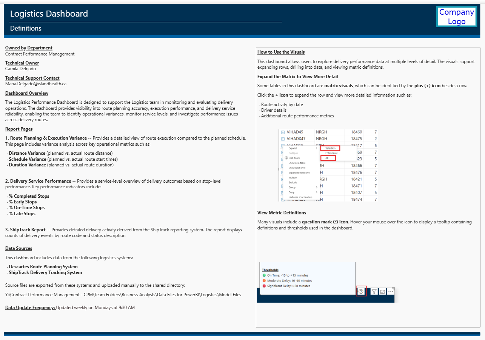

# Master of Data Science and Analytics Program
**University of Calgary**

A sample of assignments and final projects that demonstrate my knowledge and proficiency in the Master of Data Science and Analytics program, completed with a 3.8/4 GPA.

---

## Sample Dashboard Work (Power BI)

Below are examples of dashboard work developed in Power BI.
Dashboard screenshots can be found in the **[Images](images/)** folder within this repository.

*All data shown in screenshots has been modified (including potential identifiers) to protect client privacy.*

### Logistics Performance Dashboard

The Logistics Performance Dashboard is designed to support the Logistics team in monitoring and evaluating delivery operations. It provides visibility into route planning accuracy, execution performance, and delivery service reliability, enabling the team to identify operational variances, monitor service levels, and investigate performance issues across delivery routes.

*Navigation overview for users — includes technical owner, data sources, and instructions on how to use the dashboard*

*Tracks on-time delivery rates and service performance across all routes*

*Daily and monthly scan volume trends across all locations*

*Breakdown of scan volume categorized by delivery status*

*Compares planned vs actual route distances across all drivers*

*Compares planned vs actual route durations across all drivers*

---

## List of Courses

1. **DATA601 - Working with Data and Visualization**
2. **DATA602 - Statistical Data Analysis**
3. **DATA603 - Statistical Modelling with Data**
4. **DATA604 - Working with Data at Scale**
5. **DATA605 - Actionable Visualization and Analytics**
6. **DATA606 - Statistical Methods in Data Science**
7. **DATA607 - Machine Learning**
8. **DATA608 - Developing Big Data Applications**
