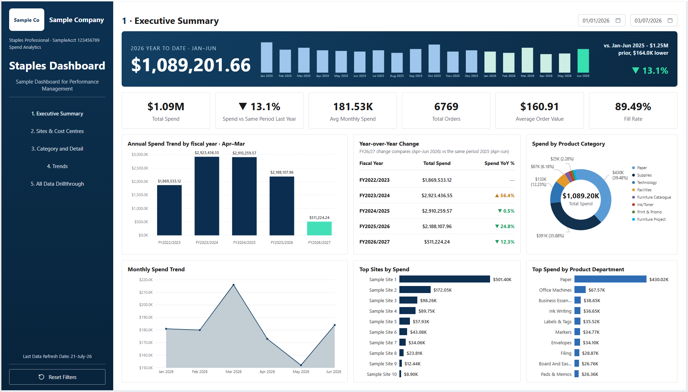

# Master of Data Science & Professional Experience Portfolio

**University of Calgary**

A sample of assignments and final projects that demonstrate my knowledge and proficiency in the Master of Data Science and Analytics program, completed with a 3.8/4 GPA.

---

## Dashboard Samples (Power BI)

Below are examples of dashboard work developed in Power BI. Dashboard screenshots can be found in the [Images](./images) folder within this repository.

> ⚠️ **IMPORTANT:**
> *All data shown in screenshots has been modified (including potential identifiers) to protect client privacy.*

---

### Staples Spend Analytics Dashboard

An executive-level Power BI dashboard providing an overview of spending activity for a Staples business account. The Executive Summary highlights year-to-date spend, year-over-year changes, average monthly spend, order volume, average order value, fill rate, and key spending trends.

Additional pages break the data down by site and cost centre, product category and department, monthly and fiscal-year trends, and individual transaction-level records.

---

### Logistics Driver Duration Report

A Power BI report offering a detailed view of driver route duration performance. It compares planned versus actual route times, highlights duration variances, and summarizes key measures such as total routes, average actual hours, average minutes per stop, and time saved or lost against plan.

Users can filter by reporting period, route code, and driver to review daily route-level results, compare individual performance against fleet averages, flag incomplete records, and monitor efficiency trends over time.

---

### Logistics Driver Performance Watchlist

A Power BI report that identifies drivers with repeated schedule or route-duration outliers during the selected reporting period. Schedule outliers are routes that started or finished more than 30 minutes off plan; duration outliers are routes that ran more than 30 minutes longer or shorter than planned.

The report classifies drivers into **watch** and **chronic** performance categories, provides route-level details for follow-up, and includes an eight-week trend view showing whether outlier patterns are improving, worsening, or recurring. Interactive filters allow analysis by date, route code, and driver.

---

## List of Courses

1. **DATA601** – Working with Data and Visualization
2. **DATA602** – Statistical Data Analysis
3. **DATA603** – Statistical Modelling with Data
4. **DATA604** – Working with Data at Scale
5. **DATA605** – Actionable Visualization and Analytics
6. **DATA606** – Statistical Methods in Data Science
7. **DATA607** – Machine Learning
8. **DATA608** – Developing Big Data Applications
